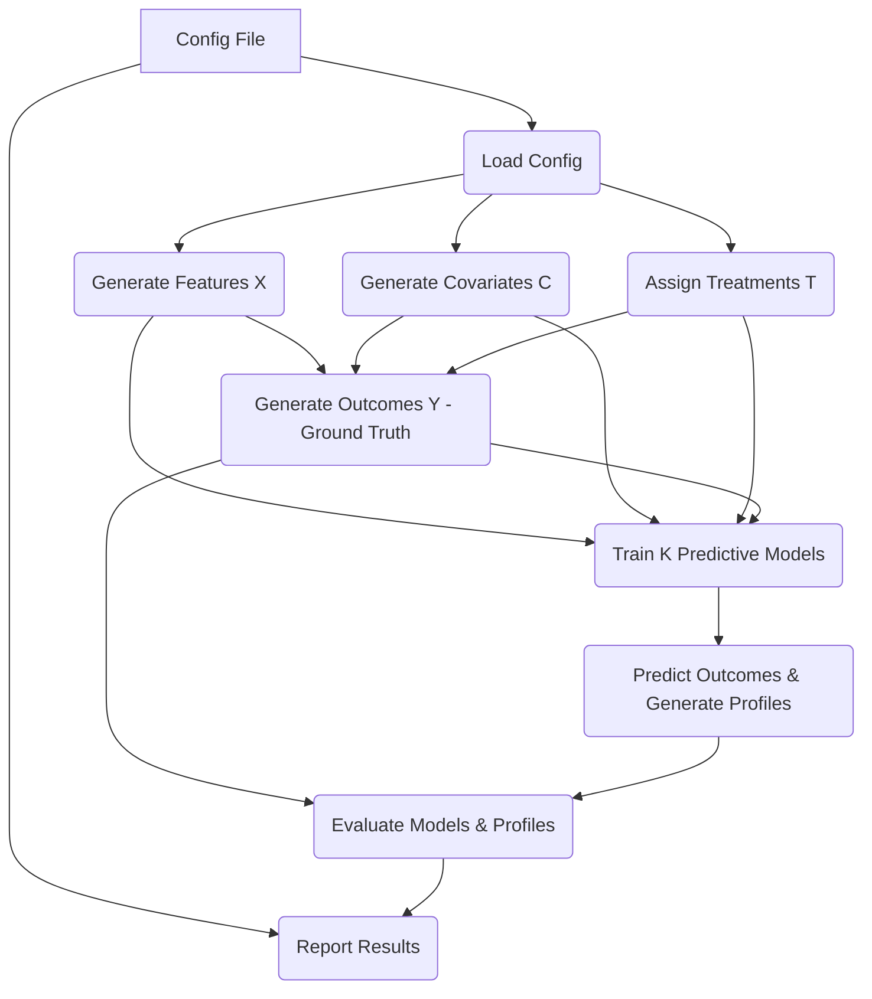

# Technical Specification: Predictive Multi-Arm, Multi-Biomarker Simulation Framework

## 1. Overview and Objectives

### 1.1. Overview
This document specifies a Python-based simulation framework designed to evaluate the potential and limitations of building predictive models for differential treatment outcomes in multi-arm clinical trials. Unlike previous simulations focused on validating specific, pre-defined biomarker-treatment interactions (1-to-1 mapping), this framework embraces a more complex scenario:
*   Utilizes a potentially large set of **featurized** biomarkers derived from multiple "instruments" (e.g., EEG, EHR, blood, voice).
*   Allows features to have varying properties (signal-to-noise ratio (SNR), relevance to different treatments, prognostic effects).
*   Features are not restricted to a 1-to-1 mapping with treatments; a feature can influence outcomes under multiple treatments or none.
*   Incorporates patient covariates (e.g., disease indication) influencing outcomes.
*   Focuses on building and evaluating **K predictive models** (one per treatment arm) to generate patient-specific profiles of predicted outcomes or treatment benefits.

The core assumption is that raw data processing and featurization have already occurred. This framework simulates the *post-featurization* trial and modeling process.

### 1.2. Objectives
*   Simulate realistic, multi-modal feature sets (`X`) with configurable properties (number of features per instrument, correlation structure, SNR, sparsity of effects).
*   Generate patient outcomes (`Y`) based on a "ground truth" model where outcomes depend on the assigned treatment (`T=k`), the full feature set (`X`), and covariates (`C`), allowing for complex interactions and differential feature effects across treatments.
*   Implement a pipeline to train K distinct predictive models, where model `M_k` predicts the outcome `Y` *if* the patient were to receive treatment `k`, using `X` and `C` as inputs.
*   Evaluate the performance of the K predictive models using standard metrics (e.g., R², RMSE).
*   Evaluate the framework's ability to generate accurate patient profiles indicating relative treatment benefit or predicted outcomes across arms.
*   Assess the impact of simulation parameters (e.g., number of features, SNR, correlation, sample size, sparsity of true effects) on the feasibility and accuracy of building useful predictive treatment selection models.

## 2. General Architecture

The simulation will follow a modular pipeline architecture:

1.  **Configuration Loading:** Read simulation parameters from a configuration file (e.g., YAML).
2.  **Data Generation:**
    *   Generate the feature matrix `X` based on instrument definitions and feature properties.
    *   Generate covariate matrix `C`.
    *   Assign treatments `T` via randomization.
    *   Generate outcomes `Y` using a ground truth generative model incorporating `T`, `X`, `C`, and noise.
3.  **Predictive Modeling:**
    *   Split data (optional, e.g., for internal validation).
    *   Train K independent models (`M_1`...`M_K`), where `M_k` is trained using data only from patients assigned to arm `k` (or using all data but modeling treatment interaction). *Decision: Initially train M_k only on arm k data for simplicity.*
    *   Store trained models.
4.  **Prediction & Profiling:**
    *   For each patient `i` (potentially in a hold-out set or simulated new patients), use all K models to predict their outcome under *each* treatment: `Ŷ_i = [M_1(X_i, C_i), M_2(X_i, C_i), ..., M_K(X_i, C_i)]`.
    *   Generate patient profiles (e.g., predicted benefit of each treatment vs. a reference or average).
5.  **Evaluation:**
    *   Calculate standard predictive performance metrics for each `M_k` (e.g., comparing `M_k(X_k, C_k)` to `Y_k` for patients in arm `k`).
    *   Calculate "treatment selection" performance metrics by comparing the profile `Ŷ_i` to the *true* outcomes patient `i` would have experienced under each treatment according to the ground truth generative model.
6.  **Reporting:** Summarize configuration, results, and performance metrics.



## 3. Component Breakdown

*   **`config_loader.py`:** Parses a YAML/JSON configuration file.
*   **`feature_generator.py`:**
    *   Input: Config defining instruments (e.g., `EEG`, `EHR`), number of features per instrument, correlation structure (e.g., block-diagonal based on instruments, plus shared latent factors), SNR parameters, sparsity masks/coefficients defining which features have true prognostic effects (\(\beta_{2}\)-like).
    *   Output: `pandas.DataFrame` `X`.
*   **`covariate_generator.py`:**
    *   Input: Config defining covariates (e.g., `disease_indication` distribution).
    *   Output: `pandas.DataFrame` `C`.
*   **`treatment_assigner.py`:**
    *   Input: Number of arms `K`, number of subjects `N`, allocation probabilities `p`.
    *   Output: `numpy.array` `T`.
*   **`outcome_generator.py`:**
    *   Input: `X`, `C`, `T`, config defining the ground truth model coefficients (potentially different sets of coefficients for each arm `k`, defining main effects of `X`, `C`, and interactions `T*X`, `T*C`, `T*X*X`), noise level `sigma_y`.
    *   The ground truth structure needs to allow features to have different impacts depending on the treatment received. Example structure for patient `i` assigned treatment `k`:
        `Y_i = g( base_k + effect(C_i, k) + sum_j effect(X_ij, k) + sum_{j,l} interaction_effect(X_ij, X_il, k) ) + noise_i`
        where `g` is an optional link function, and effects can be zero for many features/interactions, specific to arm `k`.
    *   Output: `numpy.array` `Y`.
*   **`predictive_modeler.py`:**
    *   Input: `X`, `C`, `T`, `Y`, config specifying model type (e.g., `Ridge`, `Lasso`, `RandomForestRegressor`) and hyperparameters.
    *   Trains K models `M_1`...`M_K` using data where `T=1`, `T=2`, ..., `T=K` respectively.
    *   Output: List or dictionary of trained model objects.
*   **`profiler.py`:**
    *   Input: Trained models `M_1..M_K`, new data `X_new`, `C_new`.
    *   Output: `pandas.DataFrame` of predicted outcomes (subjects x K arms). `pandas.DataFrame` of derived profiles (e.g., predicted benefit vs reference).
*   **`evaluator.py`:**
    *   Input: Predicted outcomes/profiles, true outcomes `Y`, ground truth outcomes under counterfactual treatments (requires calling `outcome_generator` without noise for all arms), treatment assignment `T`.
    *   Output: Dictionary of performance metrics (standard R²/RMSE per model, treatment selection accuracy, average regret, etc.).
*   **`reporter.py`:**
    *   Input: Config, evaluation results.
    *   Output: Console logs, CSV files, potentially plots.

## 4. Data Models and Schemas

*   **Configuration (`config.yaml`):**
    ```yaml
    simulation_params:
      n_subjects: 500
      n_sims: 100
      random_seed: 42
    instruments:
      EEG:
        n_features: 100
        correlation_factor: 0.7 # Internal correlation
        base_snr: 0.1
      EHR:
        n_features: 50
        correlation_factor: 0.3
        base_snr: 0.3
      Blood:
        n_features: 20
        correlation_factor: 0.5
        base_snr: 0.2
    feature_params:
      global_correlation: 0.1 # Across instruments
      prognostic_sparsity: 0.1 # Fraction of features with main effect on Y
    treatment_params:
      n_arms: 4
      allocation: [0.25, 0.25, 0.25, 0.25]
    covariates:
      disease_indication:
        type: categorical # e.g., MDD/Bipolar
        categories: [0, 1]
        prevalence: [0.6, 0.4]
    ground_truth_model:
      # Coefficients defining how X, C affect Y *differently* per arm T=k
      # Needs detailed structure, e.g., nested dicts mapping (arm, feature_idx) -> coeff
      arm_coefficients: {...}
      interaction_coefficients: {...} # T*X, T*C etc.
      noise_std_dev: 1.0
    predictive_modeling:
      model_type: Lasso
      hyperparameters: {alpha: 0.1}
      # cross_validation: {k_folds: 5} # Optional
    evaluation:
      metrics: ['r2', 'rmse', 'treatment_selection_accuracy', 'regret']
    ```
*   **Features (`X`):** `pandas.DataFrame`, shape `(n_subjects, n_total_features)`. Columns like `EEG_001`, `EHR_001`, ...
*   **Covariates (`C`):** `pandas.DataFrame`, shape `(n_subjects, n_covariates)`. Columns like `disease_indication`.
*   **Treatment (`T`):** `numpy.array`, shape `(n_subjects,)`. Values `1` to `K`.
*   **Outcome (`Y`):** `numpy.array`, shape `(n_subjects,)`. Continuous values.
*   **Ground Truth Coefficients:** Internal data structure (e.g., nested dictionaries or sparse matrices) mapping `(arm, feature/covariate/interaction)` to its true effect size.
*   **Trained Models:** List `[model_1, model_2, ..., model_K]` where each is a fitted scikit-learn compatible estimator.
*   **Predicted Outcomes:** `pandas.DataFrame`, shape `(n_subjects, K)`. Columns `pred_Y_arm1`, ..., `pred_Y_armK`.
*   **Patient Profiles:** `pandas.DataFrame`, derived from predicted outcomes (e.g., `benefit_arm2_vs_arm1`).
*   **Evaluation Results:** Dictionary mapping metric names to values or lists of values (across simulations).

## 5. Implementation Phases

1.  **Phase 1: Core Data Generation & Basic Modeling**
    *   Implement `config_loader`, basic `feature_generator` (uncorrelated features, basic SNR), `treatment_assigner`, `covariate_generator`.
    *   Implement `outcome_generator` with a simpler ground truth (e.g., only main effects of `T`, some `X`, `C`, minimal interaction).
    *   Implement basic `predictive_modeler` (e.g., using `LinearRegression` or `Ridge`).
    *   Implement basic `evaluator` (R²/RMSE).
2.  **Phase 2: Advanced Feature & Outcome Generation**
    *   Enhance `feature_generator` with correlation structures (within/across instruments) and configurable SNR.
    *   Enhance `outcome_generator` with complex ground truth model allowing differential effects per arm (`T*X`, `T*C` interactions). Define schema for specifying these coefficients in config.
3.  **Phase 3: Predictive Profiling & Evaluation**
    *   Implement `profiler` to generate predicted outcome matrices.
    *   Implement advanced evaluation metrics in `evaluator` focusing on treatment selection accuracy, regret, etc. This requires generating counterfactual ground truth outcomes.
4.  **Phase 4: Refinement & Usability**
    *   Implement flexible model selection (`Lasso`, `RandomForest`, etc.) and hyperparameter passing in `predictive_modeler`.
    *   Develop robust `reporter`.
    *   Add documentation (docstrings, README).
    *   Consider parallelization (`joblib`) for running multiple simulations.
    *   Implement thorough testing.

## 6. Technical Dependencies and Requirements

*   **Language:** Python 3.8+
*   **Core Libraries:**
    *   `numpy`: Numerical operations.
    *   `pandas`: Data manipulation and storage.
    *   `scikit-learn`: Predictive modeling, metrics, potential feature generation utilities.
    *   `PyYAML` (or `json`): Configuration file parsing.
*   **Optional Libraries:**
    *   `matplotlib`, `seaborn`: Plotting results.
    *   `scipy`: Statistical functions, sparse matrices.
    *   `joblib`: Parallel execution of simulations.
    *   Advanced ML models: `xgboost`, `lightgbm` (if needed).

## 7. Testing Approach

*   **Unit Tests:** Each module (`.py` file) should have unit tests covering its core logic. Examples:
    *   `feature_generator`: Test output shape, basic correlation, handling of SNR=0 or SNR=inf.
    *   `outcome_generator`: Test output for known coefficients and zero noise. Test impact of specific interactions.
    *   `evaluator`: Test metric calculations against known results.
*   **Integration Tests:** Test the end-to-end pipeline for simple configurations. Verify data flow, shapes, and basic result plausibility. E.g., run a simulation with 1 arm, or with features unrelated to outcome.
*   **Parameter Sensitivity Tests:** Run simulations varying key parameters (noise, SNR, n_subjects, n_features, sparsity) and check if results change in the expected direction (e.g., more noise -> worse R², more subjects -> better R²).
*   **Ground Truth Recovery:** In simplified scenarios (e.g., linear ground truth, linear predictive model, low noise), verify if the predictive models approximately recover the known ground truth coefficients.
